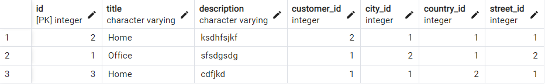
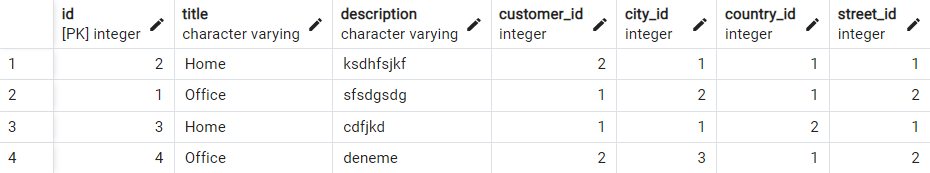
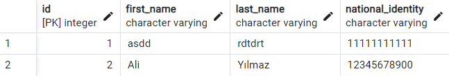
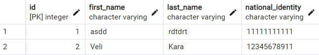
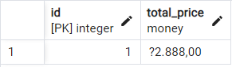
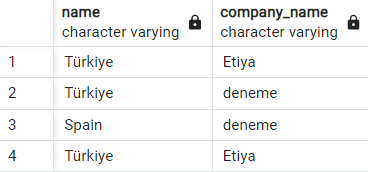
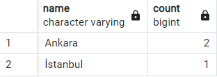
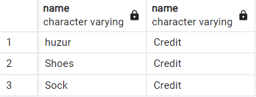
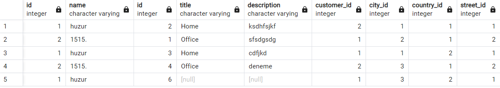
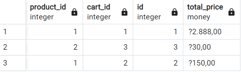

# SQL Homework
### Insert Command

```sh
Insert Into addresses(title, description, customer_id, city_id, country_id, street_id)
VALUES ('Office', 'deneme', 2, 3, 1, 2)
``` 


### Update Command

```sh
Update individual_customers 
Set first_name = 'Veli', last_name = 'Kara', national_identity = '12345678911'
where id = 2
``` 


### Between Command
```sh
Select * from carts where total_price Between '1.000' and '3.000'
``` 


### In Command
```sh
select co.name, cc.company_name from corporate_customers cc
inner join customers cu on cc.id = cu.id
inner join addresses addr on cu.id = addr.customer_id
inner join countries co on addr.country_id = co.id
where co.name in ('Türkiye', 'Spain')
``` 


### Group By Command
```sh
Select ci.name, count(*) from cities ci 
inner join addresses addr on ci.id = addr.city_id
inner join customers cu on addr.city_id = cu.id
inner join carts ca on cu.cart_id = ca.id
group by ci.name
``` 


### Inner Join Command
```sh
select pr.name, pt.name from payment_types pt
inner join payments py on pt.id = py.payment_type_id
inner join orders o on py.id = o.payment_id
inner join order_details od on o.id = od.order_id
inner join products pr on od.id = pr.id
where pt.name = 'Credit'
``` 


### Left Join Command
```sh
select * from streets st
left join addresses addr
on st.id=addr.street_id
``` 


### Right Join Command
```sh
select * from cart_details 
right join carts 
on cart_details.cart_id = carts.id
``` 

